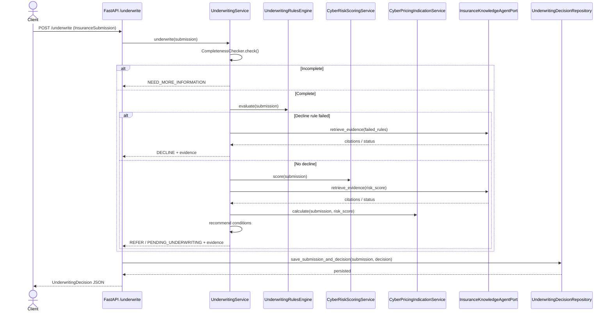
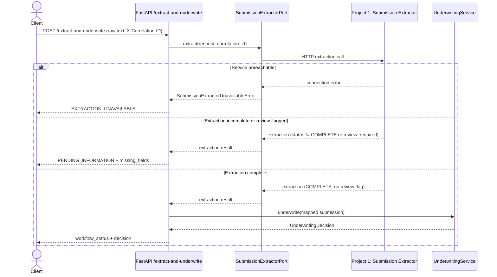

# System Architecture

## Purpose

This document describes the architecture of the **Underwriting Agent**, Project 4 of a five-project insurance agentic AI portfolio.

The application evaluates structured cyber-insurance submissions for Canadian SMEs through a strict, deterministic decision hierarchy: input validation, completeness checking, decline rules, referral rules, risk scoring, pricing, condition recommendation, documentary evidence retrieval, persistence, and optional human review. It integrates two external HTTP services — the Submission Extractor (Project 1) and the Insurance Knowledge Agent (Project 3) — without allowing either to override a deterministic underwriting outcome.

This is a portfolio and learning project. All rules, scores, pricing factors, and documents are synthetic. The system does not bind coverage, set commercial pricing, or make real underwriting decisions.

## Design Goals

- **Deterministic decisions first:** critical outcomes (`DECLINE`, `REFER`, `NEED_MORE_INFORMATION`) are computed by Python rules and versioned YAML, never by a generative model.
- **RAG and extraction are assistive, not authoritative:** external services enrich a decision with evidence or structured input; they cannot change the decision hierarchy's outcome.
- **Full traceability:** every decision persists its rule results, risk factors, conditions, evidence, and a complete audit trail.
- **Service isolation over shared state:** Projects 1 and 3 are reached exclusively through their own versioned HTTP APIs, never through direct database or vector-store access.
- **Fail-safe degradation:** an unavailable external service produces an explicit status (empty evidence, `EXTRACTION_UNAVAILABLE`) rather than blocking or silently altering a deterministic decision.
- **Human-in-the-loop:** submissions outside automated authority are persisted as `PENDING_REVIEW` and require an explicit reviewer command to resolve.

## High-Level Architecture

```mermaid
flowchart TD
    A[Raw submission text] --> B[POST /extract-and-underwrite]
    B --> C[SubmissionExtractorPort]
    C --> D[Project 1: Submission Extractor HTTP API]
    D --> E{Extraction complete\nand no review flag?}
    E -- No --> F[PENDING_INFORMATION / EXTRACTION_UNAVAILABLE]
    E -- Yes --> G[InsuranceSubmission]

    H[Structured JSON] --> I[POST /underwrite]
    I --> G

    G --> J[CompletenessChecker]
    J -- Missing critical fields --> K[NEED_MORE_INFORMATION]
    J -- Complete --> L[UnderwritingRulesEngine]

    L -- Decline rule failed --> M[DECLINE]
    L -- No decline --> N[CyberRiskScoringService]

    N --> O[CyberPricingIndicationService]
    O --> P[UnderwritingConditionsRecommender]
    N --> Q[InsuranceKnowledgeAgentPort]
    M --> Q
    Q --> R[Project 3: Insurance Knowledge Agent HTTP API]
    R --> S[UnderwritingDecision]
    P --> S

    S --> T[UnderwritingDecisionRepository]
    T --> U[SQLAlchemy: submissions, decisions, audit_events]
    S -- human_review_required=true --> V[PENDING_REVIEW]
    V --> W[POST /decisions/{id}/review]
    W --> T
```

The route to a decision is fixed before any external service is called. Neither the extraction service nor the knowledge agent can be positioned ahead of the decline/referral rules in the decision hierarchy.

## Main Components

| Component | Responsibility | External dependency |
|---|---|---|
| `api/app.py` | Defines all FastAPI routes: `/health`, `/underwrite`, `/decisions`, `/decisions/{id}`, `/decisions/{id}/review`, `/decisions/{id}/audit-trail`, `/extract-and-underwrite` | No |
| `api/dependencies.py` | Wires services, repository, and integration clients into FastAPI dependency injection | No |
| `api/extraction_models.py` | Request/response contracts for the combined extract-and-underwrite workflow | No |
| `application/underwriting_service.py` | Orchestrates the full decision hierarchy for a validated submission | No |
| `application/completeness_service.py` | Determines whether critical submission fields are present | No |
| `application/conditions_service.py` | Recommends underwriting conditions from policy templates | No |
| `domain/submission.py`, `domain/decision.py`, `domain/rules.py`, etc. | Pydantic contracts for submissions, decisions, rule results, evidence, review, and audit events | No |
| `rules/engine.py` | Evaluates deterministic decline/referral rules against the loaded policy | No |
| `rules/policy_loader.py` | Loads and validates `configs/underwriting_policy.yaml` | No |
| `scoring/risk_score.py` | Computes the 0–100 deterministic cyber-risk score and risk band | No |
| `scoring/pricing.py` | Computes the synthetic pricing indication | No |
| `integrations/knowledge_agent/http_client.py` | Calls Project 3's `/v1/retrieve-evidence` endpoint | Yes (Project 3) |
| `integrations/knowledge_agent/no_op_client.py` | Default no-op implementation used when no knowledge agent is configured | No |
| `integrations/submission_extractor/http_client.py` | Calls Project 1's extraction endpoint | Yes (Project 1) |
| `infrastructure/persistence/database.py` | Creates the SQLAlchemy engine and session factory from `settings.database_url` | No |
| `infrastructure/persistence/models.py` | ORM records for submissions, decisions, and audit events | No |
| `infrastructure/repositories/decision_repository.py` | Persists submissions/decisions, lists by review status, records reviewer commands, returns audit trails | No |
| `settings.py` | Loads `KNOWLEDGE_AGENT_BASE_URL`, `SUBMISSION_EXTRACTOR_BASE_URL`, `DATABASE_URL`, and timeouts from environment/`.env` | No |

The business layer (`application/`, `domain/`, `rules/`, `scoring/`) has no direct dependency on FastAPI, SQLAlchemy, or any HTTP client library. Integrations are injected through ports (`InsuranceKnowledgeAgentPort`, `SubmissionExtractorPort`), so a provider change requires no change to the decision hierarchy.

## Decision Hierarchy

```text
1. Input validation (Pydantic InsuranceSubmission)
2. Completeness validation (CompletenessChecker)
3. Decline rules (UnderwritingRulesEngine, RuleSeverity.DECLINE)
4. Referral rules (UnderwritingRulesEngine, RuleSeverity.REFER)
5. Risk scoring (CyberRiskScoringService)
6. Pricing indication (CyberPricingIndicationService)
7. Conditions recommendation (UnderwritingConditionsRecommender)
8. Documentary evidence retrieval (InsuranceKnowledgeAgentPort)
9. Persistence and audit trail (UnderwritingDecisionRepository)
10. Human underwriting review when human_review_required = true
```

Notably, evidence retrieval is called on **both** the decline path and the accepted/referred path in `underwriting_service.py`, so even a declined submission carries supporting citations for its reasons — the knowledge agent never influences whether the decline happens.

## Underwrite Request Sequence



## Extract-and-Underwrite Sequence



## Human Review Workflow

```text
UnderwritingDecision.human_review_required = true
    v
DecisionReview.status = PENDING_REVIEW (persisted)
    v
GET /decisions?status=PENDING_REVIEW
    v
Underwriter selects a decision
    v
POST /decisions/{decision_id}/review
    (ReviewDecisionCommand: reviewer_id, action, notes)
    v
UnderwritingDecisionRepository.review_decision()
    - LookupError -> HTTP 404 (unknown decision)
    - ValueError  -> HTTP 409 (invalid state transition)
    - Success     -> DecisionReview persisted + audit event appended
```

## Persistence Architecture

The application uses SQLAlchemy against SQLite by default (`sqlite:///data/underwriting_agent.db` locally, or a mounted volume in Docker). `infrastructure/persistence/models.py` defines ORM records for submissions, decisions, and audit events; `infrastructure/repositories/decision_repository.py` is the sole component allowed to read or write these records, keeping the domain layer free of persistence concerns.

Every `save_submission_and_decision()` call also appends an `AuditEvent`, and every reviewer action appends a further audit event, so `GET /decisions/{id}/audit-trail` always reflects the complete history of a decision from creation to final review.

## Insurance Knowledge Agent Integration (Project 3)

```text
UnderwritingService
    v
InsuranceKnowledgeAgentPort (interface)
    v
HTTPInsuranceKnowledgeAgent  -->  Project 3 POST /v1/retrieve-evidence (port 8001)
    or
NoOpInsuranceKnowledgeAgent  -->  returns empty evidence, used when no agent is configured
```

The port abstraction means the decision hierarchy code is identical whether evidence comes from a live Project 3 instance, a no-op stub, or a test double. A failure, timeout, or empty result from Project 3 populates `evidence_retrieval_status` and `evidence_retrieval_failure_reason` on the decision without altering `decision`, `risk_score`, or `indicated_premium_cad`.

## Submission Extractor Integration (Project 1)

```text
FastAPI /extract-and-underwrite
    v
SubmissionExtractorPort (interface)
    v
HTTP client  -->  Project 1 extraction endpoint (port 8000)
```

A correlation ID (`X-Correlation-ID` header) is generated if absent and echoed back in the response headers, allowing a single request to be traced across both services' logs.

## Failure Handling

| Condition | Required behavior |
|---|---|
| Missing critical submission fields | Return `NEED_MORE_INFORMATION`; no risk decision is computed |
| Decline rule triggered | Return `DECLINE` with evidence attempt; risk score is not computed |
| Knowledge agent unavailable or times out | Persist decision with empty/partial evidence and a recorded failure reason; decision outcome is unaffected |
| Submission extractor unreachable | Return `EXTRACTION_UNAVAILABLE`; do not attempt underwriting on unvalidated data |
| Extraction incomplete or flagged for review | Return `PENDING_INFORMATION` with missing fields; do not attempt underwriting |
| Unknown decision ID on review | Raise `LookupError` -> HTTP 404 |
| Invalid review state transition | Raise `ValueError` -> HTTP 409 |

A RAG or extraction failure must never silently turn a decline into an acceptance, or bypass a referral rule.

## Security and Configuration Boundaries

```text
Tracked by Git
- Source code, tests, docs
- configs/underwriting_policy.yaml
- .env.example
- pyproject.toml, uv.lock
- Dockerfile, compose.yaml

Never tracked by Git
- .env
- data/underwriting_agent.db (local SQLite state)
- Real applicant, claims, or policyholder data
```

## Extensibility

Planned next steps documented in the roadmap require:

1. Surfacing Project 3's retrieval status (`SUCCESS`/`PARTIAL`/`INSUFFICIENT_CONTEXT`) directly as a structured audit-event type.
2. Introducing LangGraph or an equivalent explicit orchestration graph around `underwriting_service.py`, making the referral pause and multi-service retries first-class graph nodes.
3. Adding a circuit breaker/retry policy around both HTTP integration clients.
4. Integrating Project 2 (Data Analyst Agent) for portfolio-level context without altering the deterministic hierarchy.

## Current Limitations

- Only the `CYBER_SME` product line is supported.
- Pricing is a synthetic technical indication, not a commercial premium.
- The knowledge-agent integration depends on Project 3 running and being correctly indexed; a stopped Project 3 degrades to empty evidence rather than failing the request.
- SQLite is single-writer; concurrent underwriters reviewing decisions at scale would benefit from a multi-writer database.
- There is no LangGraph or workflow-engine orchestration yet; the decision hierarchy is expressed as sequential Python calls in `underwriting_service.py`.
